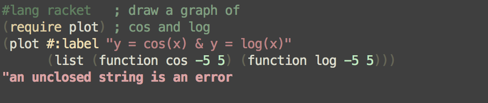

Zenburn Color scheme for DrDracket
================

This package defines a zenburn colorscheme
for [DrRacket](http://www.racket-lang.org).

More information about Zenburn.

Installation
--------------

From the package catalog:

  * `raco pkg install drracket-zenburn`

Directly from github:

  * `raco pkg install git://github.com/tautologico/drracket-zenburn`

License
-------

Distributed under the MIT license. See the COPYING file.
